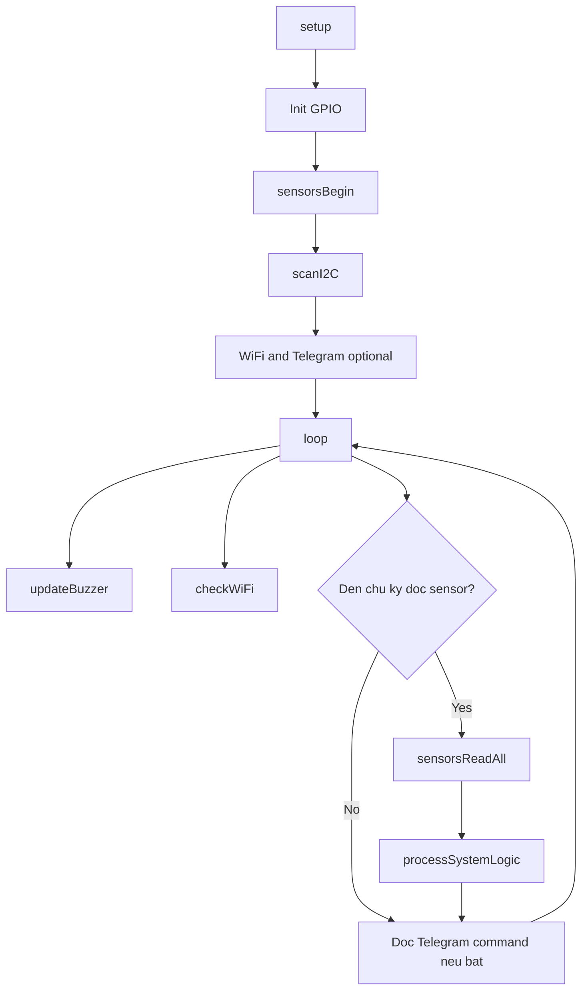

# Codeflow

## Muc tieu
Tai lieu nay mo ta luong code chinh cua firmware trong [main.ino](/c:/Main_Project_ThayKien/src/main/main.ino).

## Cau truc tong quan
- `Config`: khai bao chan GPIO, nguong canh bao, timing, feature flags.
- `Enums/Structs`: dinh nghia `SensorStatus`, `AlertLevel`, `SystemState`, `SensorData`.
- `Global state`: luu trang thai he thong, cooldown, suppress, WiFi, buzzer.
- `Helper functions`: validate du lieu, kiem tra I2C, warmup MQ2, suppress `/stop`.
- `Sensor functions`: khoi tao sensor, quet I2C, doc tat ca sensor, in debug.
- `Alert functions`: ket noi WiFi, gui Telegram, xu ly cooldown, cap nhat buzzer/LED.
- `State machine`: quyet dinh NORMAL, SENSOR_ALERT, SENSOR_ERROR.
- `Setup/Loop`: khoi tao va lap chu ky doc sensor.

## Luong chay chinh
1. `setup()`
2. Khoi tao Serial, GPIO, sensor, WiFi/Telegram neu bat.
3. Dat `currentState = STATE_INIT`.
4. `loop()` chay lien tuc.
5. `updateBuzzer()` cap nhat coi/den theo `currentAlertLevel`.
6. `checkWiFi()` xu ly reconnect non-blocking.
7. Moi `SENSOR_READ_INTERVAL_MS`, goi `sensorsReadAll()`.
8. Dua `SensorData` vao `processSystemLogic()`.
9. Neu Telegram bat, doc lenh va xu ly `/status`, `/reset`, `/stop`.

## Thu tu uu tien logic
Trong `processSystemLogic()`:
1. `DANGER` duoc uu tien cao nhat.
2. `Sensor error` chi xu ly neu khong co `DANGER`.
3. `WARNING` xu ly sau do.
4. Neu khong co loi/canh bao thi tro ve `STATE_NORMAL`.

## Luong canh bao
- `sendAlert()` cap nhat `currentAlertLevel` ngay lap tuc.
- Buzzer/LED phan ung ngay khi level tang.
- Cooldown chi rate-limit viec gui Telegram.
- `/stop` khong xoa logic canh bao, ma suppress `WARNING/DANGER` trong 60 giay.
- `CRITICAL` van duoc phep xuyen qua suppress.

## Luong sensor
- ENS160: doc `TVOC`, `eCO2`, `AQI`.
- AHT21: doc nhiet do va do am.
- LM75: doc nhiet do backup/cross-check.
- MQ2: doc analog, co warmup 300s va detect stuck `0`/`4095`.
- `tempAvg` uu tien trung binh LM75 + AHT21 neu hop le.

## Mermaid overview

