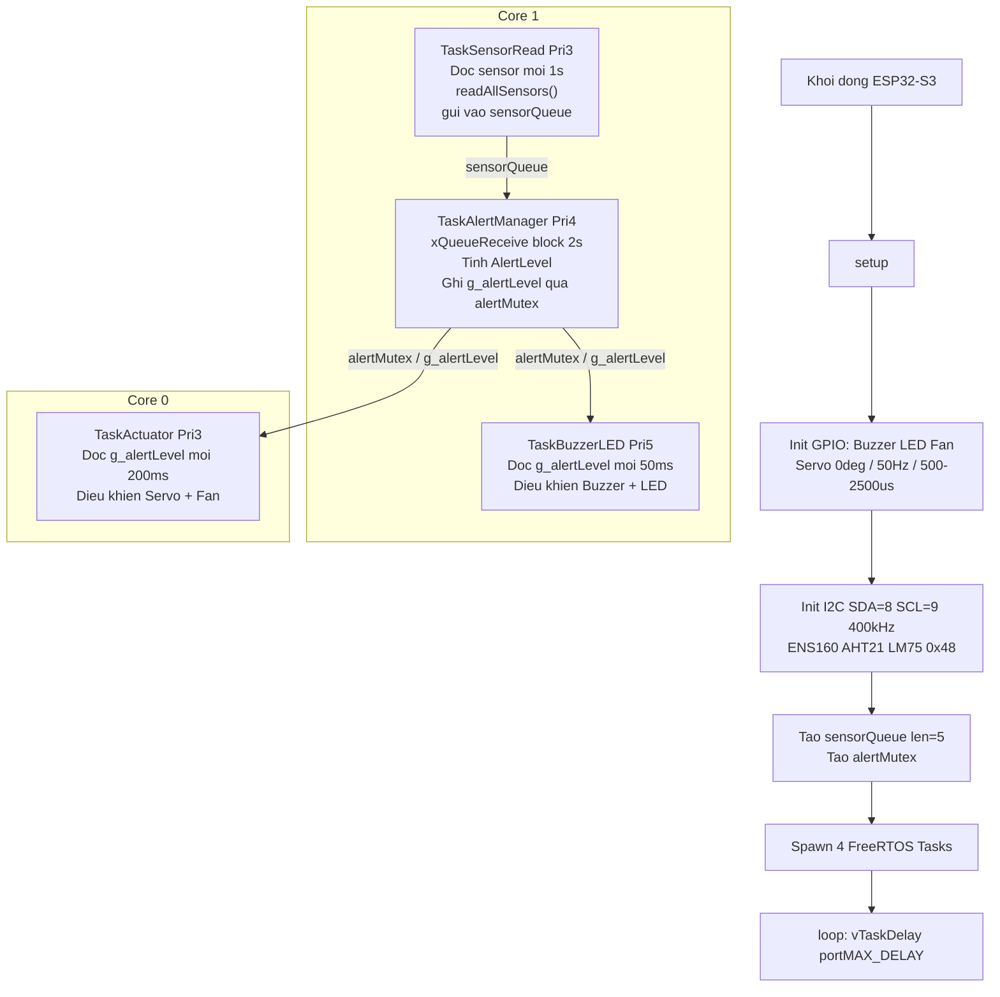

# Codeflow — Rtos_main.ino (FreeRTOS)

## Muc tieu
Mo ta luong code chinh cua firmware FreeRTOS trong `src/main/Rtos_main.ino`.  
File goc `main.ino` (single-loop, co Telegram + MQ2) van duoc giu nguyen lam tham chieu.

---

## Cau truc tong quan

| Thanh phan | Mo ta |
|---|---|
| **Config** | Khai bao chan GPIO, nguong canh bao, timing, FreeRTOS stack sizes |
| **Enums/Structs** | `SensorStatus`, `AlertLevel`, `SensorData` |
| **Global state** | Queue, Mutex, shared volatile vars (`g_alertLevel`, `g_buzzerState`, `g_lastBuzzerToggle`) |
| **Helper functions** | `i2cPresent()`, `validateTemp()`, `evalAirQuality()`, `evalTemperature()` |
| **Sensor functions** | `readAllSensors()`: Doc ENS160 + AHT21 + LM75, tinh `tempAvg`, danh gia trang thai |
| **FreeRTOS Tasks** | 4 tasks doc lap chay song song |
| **setup()** | Init GPIO/Servo/I2C/Sensor, tao Queue+Mutex, spawn 4 tasks |
| **loop()** | `vTaskDelay(portMAX_DELAY)` — nhuong hoan toan cho scheduler |

---

## GPIO / Phan cung

| Bien | Pin | Chuc nang |
|---|---|---|
| `I2C_SDA_PIN` | GPIO 8 | I2C Data |
| `I2C_SCL_PIN` | GPIO 9 | I2C Clock (400 kHz) |
| `BUZZER_PIN` | GPIO 2 | Coi bao (OUTPUT) |
| `LED_PIN` | GPIO 4 | Den bao (OUTPUT) |
| `SERVO_PIN` | GPIO 5 | Servo RC — PWM 50Hz, pulse 500–2500 µs |
| `FAN_PIN` | GPIO 6 | Quat 12V qua NPN 2N2222: HIGH=ON, LOW=OFF |
| `LM75_I2C_ADDR` | 0x48 | Dia chi I2C cua LM75 |

---

## Nguong canh bao (Thresholds)

| Thong so | WARNING | DANGER |
|---|---|---|
| TVOC (ENS160) | >= 150 ppb | >= 500 ppb |
| eCO2 (ENS160) | >= 800 ppm | >= 1500 ppm |
| AQI (ENS160) | >= 3 | >= 4 |
| Nhiet do (tempAvg) | >= 45.0 °C | >= 60.0 °C |
| Nhiet do hop le | -40 °C den 125 °C | (ngoai dai → SENSOR_ERROR) |
| Cross-check LM75 vs AHT21 | Chenh lech > 15 °C → dung LM75 lam gia tri chinh | |

---

## FreeRTOS Task Map

| Task | Core | Priority | Chu ky | Chuc nang |
|---|---|---|---|---|
| `TaskSensorRead` | Core 1 | 3 | 1000 ms | Doc ENS160 + AHT21 + LM75, gui vao `sensorQueue` |
| `TaskAlertManager` | Core 1 | 4 | Block cho queue (timeout 2s) | Nhan `SensorData`, tinh `AlertLevel`, ghi `g_alertLevel` qua `alertMutex` |
| `TaskBuzzerLED` | Core 1 | 5 | 50 ms | Doc `g_alertLevel`, dieu khien Buzzer + LED theo pattern |
| `TaskActuator` | Core 0 | 3 | 200 ms | Doc `g_alertLevel`, dieu khien Servo + Quat 12V |

---

## Luong du lieu (Data Flow)

```
[TaskSensorRead]  Core1 Pri3
    readAllSensors() moi 1000ms
    Neu queue day → xoa item cu nhat → gui item moi
    Writes: sensorQueue (xQueueSend)
         |
         v
[TaskAlertManager]  Core1 Pri4
    Reads: sensorQueue (xQueueReceive, blocking 2s)
    Tinh AlertLevel:
      DANGER   ← airQualityStatus==DANGER hoac temperatureStatus==DANGER
      WARNING  ← anySensorError (mat ket noi) HOAC airQuality/temp==WARNING
      NONE     ← binh thuong
    Writes: g_alertLevel (qua alertMutex)
         |
    +----+----+
    |         |
    v         v
[TaskBuzzerLED]    [TaskActuator]
Core1 Pri5 / 50ms   Core0 Pri3 / 200ms
Reads: g_alertLevel  Reads: g_alertLevel
Pattern buzzer/LED   Controls Servo + Fan
(qua alertMutex)     (qua alertMutex)
```

---

## Thu tu uu tien AlertLevel (trong TaskAlertManager)

1. **ALERT_DANGER** — `airQualityStatus == SENSOR_DANGER` HOAC `temperatureStatus == SENSOR_DANGER`
2. **ALERT_WARNING** — `anySensorError == true` (mat it nhat 1 cam bien)
3. **ALERT_WARNING** — `airQualityStatus == SENSOR_WARNING` HOAC `temperatureStatus == SENSOR_WARNING`
4. **ALERT_NONE** — moi thu binh thuong

> **Luu y:** `ALERT_CRITICAL` chi duoc dung trong `TaskBuzzerLED` (buzzer lien tuc), KHONG phat ra tu `TaskAlertManager`.

---

## Pattern Buzzer/LED (TaskBuzzerLED — 50ms tick)

| AlertLevel | LED | Buzzer |
|---|---|---|
| NONE / INFO | OFF | OFF |
| WARNING | ON | Nhap nhay cham: 200 ms ON / 800 ms OFF |
| DANGER | ON | Nhap nhay nhanh: 100 ms ON / 200 ms OFF |
| CRITICAL | ON | Bat lien tuc (HIGH) |

Bien trang thai buzzer (`g_buzzerState`, `g_lastBuzzerToggle`) la volatile global, duoc cap nhat truc tiep trong task.

---

## Logic Actuator (TaskActuator — 200ms tick)

| AlertLevel | Servo | Quat 12V (GPIO6 — NPN 2N2222) |
|---|---|---|
| NONE / INFO | 0° (dong) | OFF |
| WARNING | 90° (mo mot phan) | ON |
| DANGER / CRITICAL | 180° (mo hoan toan) | ON |

- Servo chi ghi khi goc thay doi (tranh jitter).
- Quat chi ghi khi trang thai thay doi.

---

## Logic Sensor Fusion (readAllSensors)

```
ENS160 → tvoc, eco2, aqi      (neu available)
AHT21  → ahtTemp, humidity     (neu getEvent() thanh cong + validateTemp)
LM75   → lm75Temp              (neu i2cPresent(0x48) + validateTemp)

tempAvg:
  ca hai hop le:
    → tempAvg = (lm75 + aht) / 2
    → neu |lm75 - aht| > 15°C → tempCrossCheckOk=false, dung lm75 lam chinh
  chi lm75 hop le → tempAvg = lm75
  chi aht21 hop le → tempAvg = aht
  ca hai loi → tempAvg = NAN

temperatureStatus:
  uu tien tempAvg → lm75 → aht21 → NAN → SENSOR_ERROR

anySensorError = true neu bat ky cam bien nao mat ket noi
errorCount = tong so cam bien loi
```

---

## Dong bo hoa (Synchronization)

| Primitive | Loai | Bao ve |
|---|---|---|
| `sensorQueue` | `QueueHandle_t` (len=5, sizeof SensorData) | Truyen `SensorData` tu TaskSensorRead sang TaskAlertManager |
| `alertMutex` | `SemaphoreHandle_t` (mutex) | Bao ve `g_alertLevel` khi doc/ghi tu TaskAlertManager / TaskBuzzerLED / TaskActuator |

- Neu queue day, item cu nhat bi xoa de nhuong cho item moi nhat (`xQueueReceive` + `xQueueSend`).
- TaskAlertManager take mutex timeout 50ms khi ghi `g_alertLevel`.
- TaskBuzzerLED / TaskActuator take mutex timeout 10ms khi doc `g_alertLevel`.

---

## Mermaid overview (FreeRTOS)



---

## Ghi chu — Fall Detection (PENDING)

- Board **XIAO ESP32-S3** + MPU6050 + Edge Impulse model dang duoc dev khac thuc hien.
- Giao thuc tich hop: **WiFi hoac ESP-NOW** (chua chot).
- Khi san sang: se them `TaskFallDetect` vao `Rtos_main.ino` de xu ly tin hieu nga tu XIAO.
