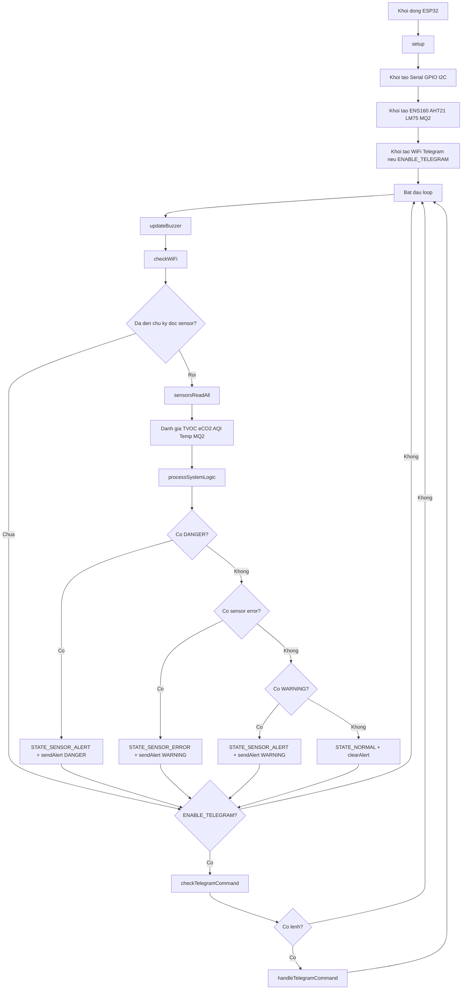
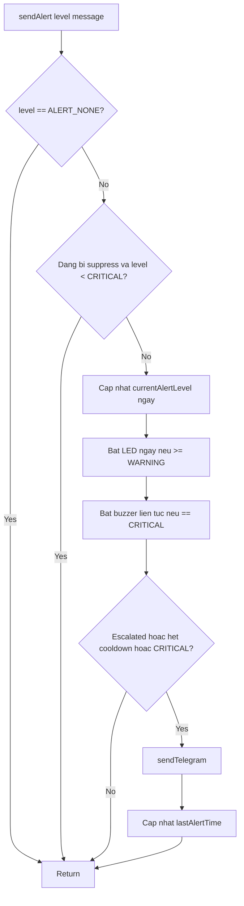
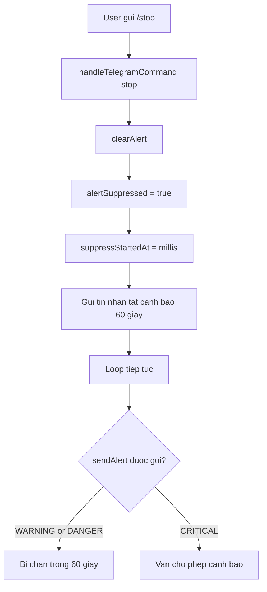

# Nguyen Ly Hoat Dong Cua Code

Tai lieu nay mo ta nguyen ly hoat dong cua firmware ESP32-S3 bang flowchart `mermaid`.

## Mo ta ngan
- He thong doc du lieu tu ENS160, AHT21, LM75 va MQ2.
- Sau moi chu ky, du lieu duoc danh gia thanh `OK`, `WARNING`, `DANGER`, `ERROR`, hoac `WARMUP`.
- State machine uu tien an toan: neu co `DANGER` thi bao dong ngay, neu khong moi xu ly `sensor error`.
- Buzzer/LED phan ung theo `AlertLevel`.
- Telegram chi la kenh thong bao/phat lenh, khong chi phoi logic an toan.

## Flowchart tong the

## Flowchart chi tiet sendAlert

## Flowchart `/stop`

