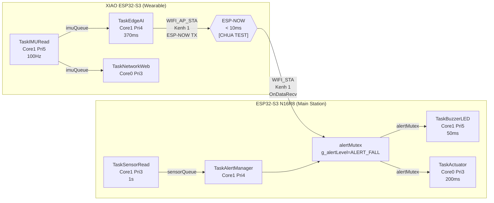
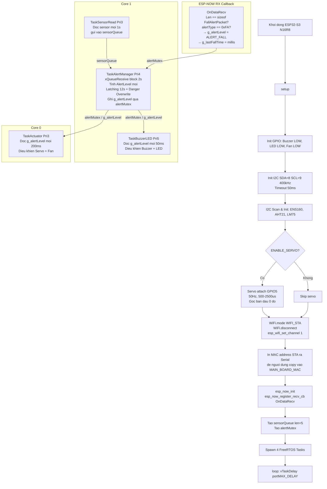
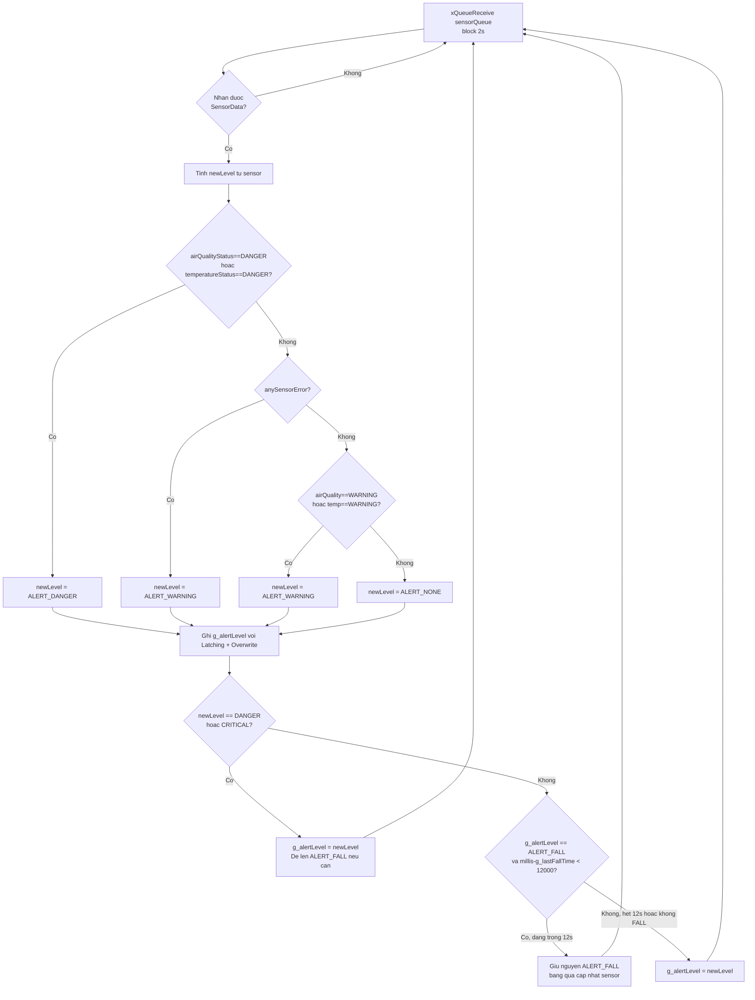
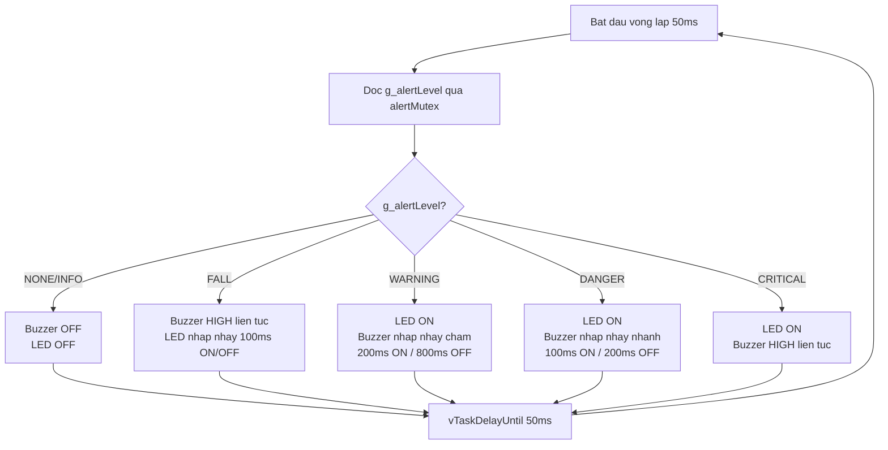
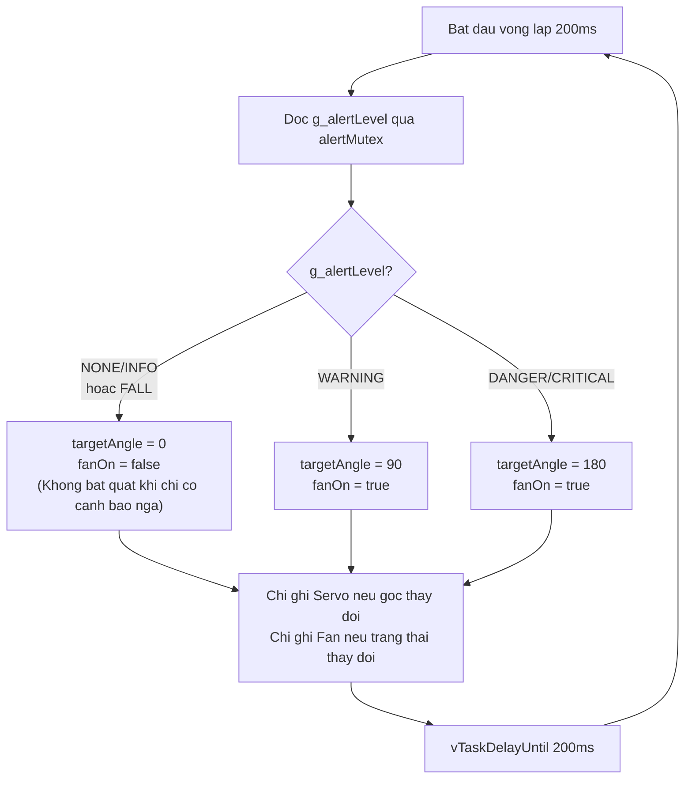
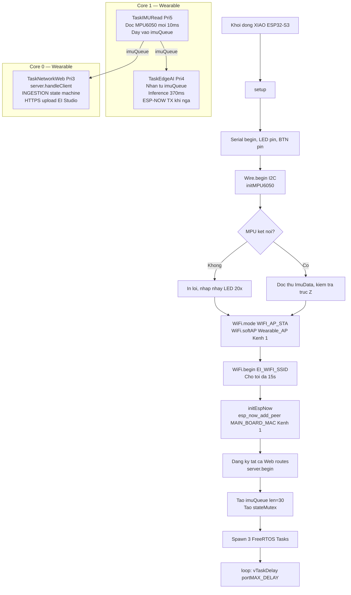
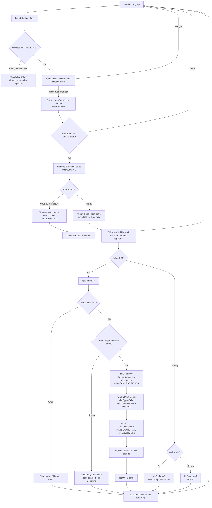
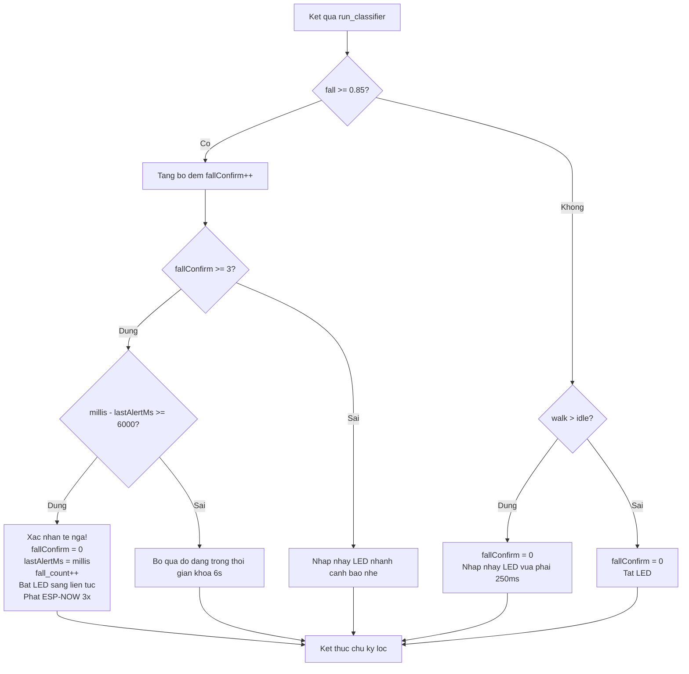

# Nguyen Ly Hoat Dong — He Thong Giam Sat Moi Truong & Phat Hien Te Nga

Cap nhat: 2026-05-20 | Trang thai: ESP-NOW code xong, chua test thuc te

---

## TONG QUAN HE THONG

He thong gom 2 board giao tiep voi nhau qua ESP-NOW Unicast kenh Wi-Fi 1:

---

## PHAN 1: FLOWCHART KHOI DONG — TRAM CHINH (Rtos_main.ino)

---

## PHAN 2: FLOWCHART TINH ALERT LEVEL — TaskAlertManager

---

## PHAN 3: FLOWCHART BUZZER/LED — TaskBuzzerLED

---

## PHAN 4: FLOWCHART ACTUATOR — TaskActuator

---

## PHAN 5: FLOWCHART KHOI DONG — THIET BI DEO (wearable_unified_rtos.ino)

---

## PHAN 6: FLOWCHART SUY LUAN AI & PHAT ESP-NOW — TaskEdgeAI

---

## PHAN 7: FLOWCHART BO LOC CHONG BAO GIA (Debounce & Cooldown)

---

## PHAN 8: LICH SU CAP NHAT

| Ngay | Noi dung cap nhat |
|---|---|
| 2026-04-22 | Khoi tao he thong, firmware baseline main.ino |
| 2026-05-15 | Tao Rtos_main.ino — FreeRTOS 4 tasks, bo Telegram/MQ2, them Servo+Fan |
| 2026-05-18 | Hoan thien fall detection XIAO (Edge Impulse + Web UI tieng Viet + Debounce/Cooldown) |
| 2026-05-20 | Tich hop FreeRTOS vao Wearable (3 tasks), sua loi I2C co lap Core1 |
| 2026-05-20 | **Tich hop ESP-NOW TX/RX ca 2 board, ALERT_FALL=5, Latching 12s, Danger Overwrite** |
| — | **TODO: Test thuc te ESP-NOW tren 2 thiet bi** |
