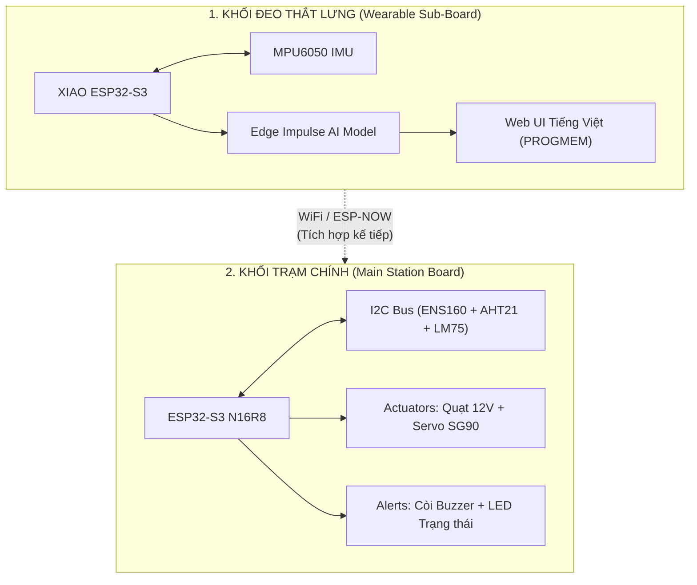
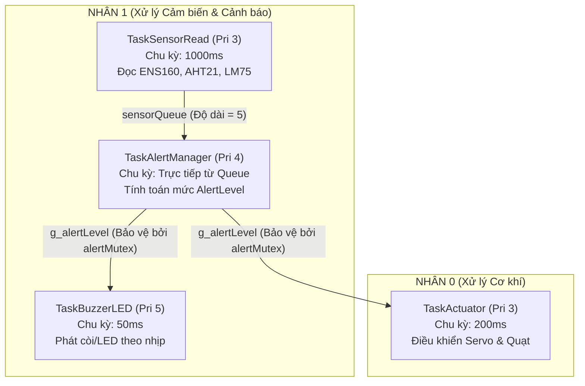

# HỆ THỐNG GIÁM SÁT MÔI TRƯỜNG & PHÁT HIỆN TÉ NGÃ THÔNG MINH (EDGE AI)
## BÁO CÁO TIẾN ĐỘ DỰ ÁN (WORK IN PROGRESS) - TÀI LIỆU PHỤC VỤ THIẾT KẾ SLIDE TRÊN NOTEBOOKLM

> ⚠️ **LƯU Ý QUAN TRỌNG:** Đây là **BÁO CÁO TIẾN ĐỘ DỰ ÁN** (chưa phải phiên bản thương mại hoàn chỉnh). Hệ thống đang được tích hợp cuốn chiếu theo từng giai đoạn thử nghiệm.

---

## 📌 CHƯƠNG I: TỔNG QUAN DỰ ÁN (OVERVIEW)

### 1. Đặt vấn đề & Mục tiêu dự án
*   **Vấn đề thực tế:** Sự kết hợp nguy hiểm giữa các yếu tố môi trường độc hại (khí độc eCO2, TVOC, nhiệt độ tăng cao do hỏa hoạn) và các tai nạn cá nhân (té ngã ở người cao tuổi hoặc công nhân trong phân xưởng sản xuất).
*   **Mục tiêu dự án:** Xây dựng một hệ sinh thái giám sát kép thông minh:
    1.  **Hệ thống cố định (Main Board):** Giám sát thời gian thực các chỉ số chất lượng không khí, nhiệt độ, độ ẩm và tự động phản ứng cơ khí (quạt gió, servo cửa thông phòng).
    2.  **Hệ thống đeo thắt lưng (Wearable Board):** Nhận diện hành vi con người (Đứng yên, Đi bộ, Té ngã) bằng mô hình Học máy nhúng (Edge AI) chạy trực tiếp trên thiết bị (On-device Inference).

### 2. Kiến trúc hai khối độc lập (Dual-Board Architecture)
Hệ thống được thiết kế dạng mô-đun hóa với sự phân chia nhiệm vụ tối ưu:



---

## 🛠️ CHƯƠNG II: THÔNG SỐ KỸ THUẬT & SƠ ĐỒ PHẦN CỨNG

### 1. Board điều khiển chính (Main Station)
*   **MCU:** ESP32-S3 N16R8 (16MB Flash, 8MB PSRAM cấu hình OPI).
*   **Bộ nhớ:** Hỗ trợ dung lượng lưu trữ lớn phục vụ lưu trữ web UI và đệm dữ liệu.
*   **Hệ điều hành:** FreeRTOS đa nhiệm thời gian thực (Real-time Multitask).

### 2. Bảng phân phối chân linh kiện (Pin Mapping)

#### Khối Trạm Chính (Main ESP32-S3)
| Linh kiện | Chân GPIO | Vai trò / Phương thức giao tiếp |
| :--- | :--- | :--- |
| **Buzzer** | GPIO2 | Còi phát tín hiệu âm thanh cảnh báo |
| **Status LED** | GPIO4 | Đèn chỉ thị nhịp trạng thái |
| **Servo SG90** | GPIO5 | Động cơ mở van thông khí (PWM 50Hz, 500-2500µs) |
| **Fan 12V** | GPIO6 | Quạt hút khí độc (Được đệm qua Transistor NPN 2N2222) |
| **I2C SDA** | GPIO8 | Chân truyền dữ liệu cảm biến I2C |
| **I2C SCL** | GPIO9 | Chân nhịp xung clock cảm biến I2C (400 kHz) |

#### Khối Đeo Thắt Lưng (XIAO ESP32-S3 Sub-board)
| Linh kiện | Chân GPIO | Vai trò / Phương thức giao tiếp |
| :--- | :--- | :--- |
| **MPU6050 SDA** | GPIO5 | Truyền nhận dữ liệu gia tốc và vận tốc góc |
| **MPU6050 SCL** | GPIO6 | Phát xung clock I2C cho IMU |
| **Truyền thông** | Không dây | WiFi / ESP-NOW truyền tín hiệu khẩn cấp về Trạm Chính |

---

## 🧠 CHƯƠNG III: KHỐI CHÍNH - FREERTOS ĐA NHIỆM THỜI GIAN THỰC
*(Mã nguồn phát triển: `src/Rtos_main/Rtos_main.ino`)*

Để đảm bảo tính năng an toàn tính mạng không bao giờ bị trễ do nghẽn CPU, khối trạm chính chạy 4 Task FreeRTOS độc lập phân bổ trên 2 nhân xử lý:



### 1. Đồng bộ hóa phần cứng & Phần mềm (Sync Primitives)
*   **`sensorQueue`:** Chuyển dữ liệu cấu trúc `SensorData` từ Task đọc sang Task xử lý. Cơ chế tự động giải phóng phần tử cũ nhất nếu đệm đầy để tránh thất thoát dữ liệu mới.
*   **`alertMutex`:** Khóa bảo vệ biến trạng thái toàn cục `g_alertLevel` khi được ghi từ Task Quản lý và đọc từ các Task đầu ra (Còi, Động cơ).

### 2. Thuật toán Hợp nhất Cảm biến (Sensor Fusion Logic)
*   **Cross-Check chéo nhiệt độ:** Đọc đồng thời cảm biến nhiệt độ tích hợp `AHT21` và cảm biến nhiệt độ dự phòng công nghiệp `LM75` (địa chỉ `0x48`).
*   **Thuật toán tự sửa lỗi (Self-Healing):**
    *   Nếu cả 2 cảm biến hoạt động tốt: $Nhiệt\ độ\ trung\ bình = \frac{T_{AHT21} + T_{LM75}}{2}$.
    *   Nếu phát hiện sự chênh lệch bất thường $> 15^\circ\text{C}$: Hệ thống đánh dấu trạng thái nghi ngờ, tự động ưu tiên lấy giá trị của cảm biến chính xác cao `LM75` để tính toán nhằm tránh cảnh báo giả do lỗi phần cứng.
    *   Nếu một trong hai cảm biến mất kết nối vật lý, hệ thống vẫn duy trì hoạt động bằng cảm biến còn lại và chuyển cảnh báo hệ thống sang mức `WARNING` để thông báo bảo trì.

### 3. Phân cấp Cảnh báo & Mô hình Phản ứng (Alert Levels)

| Mức Cảnh Báo (Alert Level) | Điều Kiện Kích Hoạt | Chỉ Thị Buzzer / LED | Trạng Thái Cơ Cấu Chấp Hành (Actuator) |
| :--- | :--- | :--- | :--- |
| **ALERT_NONE** | Mọi chỉ số môi trường ở ngưỡng an toàn | LED: **OFF**<br>Buzzer: **OFF** | Servo: **0°** (Đóng cửa thông gió)<br>Quạt 12V: **OFF** (Tiết kiệm điện) |
| **ALERT_WARNING** | Mất kết nối $\ge 1$ cảm biến<br>**Hoặc:** eCO2 $\ge 800$ppm, TVOC $\ge 150$ppb, AQI $\ge 3$, Temp $\ge 45^\circ\text{C}$ | LED: **ON**<br>Buzzer: **200ms ON / 800ms OFF** (Nhịp chậm) | Servo: **90°** (Mở hé cửa thông gió)<br>Quạt 12V: **ON** (Thông khí nhẹ) |
| **ALERT_DANGER** | eCO2 $\ge 1500$ppm, TVOC $\ge 500$ppb, AQI $\ge 4$, Temp $\ge 60^\circ\text{C}$ | LED: **ON**<br>Buzzer: **100ms ON / 200ms OFF** (Nhịp dồn dập) | Servo: **180°** (Mở toang toàn bộ cửa)<br>Quạt 12V: **ON** (Hút khí công suất tối đa) |
| **ALERT_CRITICAL** | Phát hiện té ngã khẩn cấp từ Wearable Sub-Board | LED: **ON**<br>Buzzer: **ON LIÊN TỤC** (Hét còi cấp cứu) | Servo: **180°** (Mở cửa thoát hiểm)<br>Quạt 12V: **ON** |

---

## 🏃 CHƯƠNG IV: THIẾT BỊ ĐEO THẮT LƯNG - AI NHẬN DIỆN TÉ NGÃ EDGE AI
*(Mã nguồn phát triển: `src/wearable/wearable_unified/`)*

Thiết bị sử dụng cảm biến quán tính 6 trục MPU6050 kết hợp với nhân vi điều khiển XIAO ESP32-S3 nhỏ gọn.

### 1. Động cơ hai chế độ tích hợp (Dual-Mode Engine)
*   **Chế độ 1: THU MẪU (Data Ingestion Mode)**
    *   Thu thập dữ liệu cảm biến thô (Gia tốc 3 trục $a_X, a_Y, a_Z$ và Vận tốc góc 3 trục $g_X, g_Y, g_Z$) ở tần số chuẩn $100\text{Hz}$.
    *   Tự động chia nhỏ, gán nhãn hoạt động (`idle`, `walk`, `fall`) thông qua giao diện điều khiển trực tuyến.
    *   Kết nối HTTP client bảo mật gửi thẳng tệp JSON nén lên server **Edge Impulse Studio**.
*   **Chế độ 2: SUY LUẬN (Real-time Inference Mode)**
    *   Nhúng trực tiếp mô hình phân loại được huấn luyện từ Edge Impulse bằng thư viện tối ưu hóa phần cứng.
    *   Chạy suy luận liên tục dạng cửa sổ trượt (Continuous Sliding Window) với chu kỳ đáp ứng cực nhanh $\approx 370\text{ms}$.

### 2. Công nghệ Tăng cường Dữ liệu tại chỗ (On-Device Data Augmentation)
Để giải quyết bài toán thiếu dữ liệu té ngã thực tế (vốn rất nguy hiểm khi cho người thử nghiệm ngã thật nhiều lần), hệ thống tích hợp trực tiếp thuật toán sinh dữ liệu nhân tạo ngay trên chip:
1.  **Thuật toán Nhân Tỷ Lệ (Scaling - 3x Augmentation):**
    *   Mỗi chuỗi chuyển động thô được tự động nhân bản ra 3 biến thể: **Chuỗi Gốc (x1.00)**, **Biến thể Nhẹ (x0.94)** và **Biến thể Mạnh (x1.06)**.
    *   Mô phỏng độ mạnh/yếu của các thể trạng người dùng khác nhau (người nhẹ cân rơi chậm, người nặng cân rơi nhanh).
2.  **Thuật toán Gây Nhiễu Quán Tính (Jittering Mode):**
    *   Tự động cộng thêm một lượng nhiễu ngẫu nhiên Gauss cực nhỏ vào dữ liệu gốc ($\pm0.02g$ cho gia tốc và $\pm1^\circ/\text{s}$ cho con quay hồi chuyển).
    *   Giúp tăng cường độ bền vững của mô hình AI chống lại các rung lắc môi trường không mong muốn.

### 3. Công nghệ Lọc & Khống chế Báo động Giả (Anti-False Alarm Layer)
Nếu chỉ dựa vào kết quả thô của mô hình AI, các hành động như đặt mạnh thiết bị lên bàn, vung tay đột ngột sẽ dễ gây ra báo động giả (False Positives). Hệ thống thiết lập 2 bộ lọc thông minh:

#### A. Bộ lọc tích lũy xác nhận liên tiếp (Confirm Slices Filter)
*   Tham số: `FALL_CONFIRM_SLICES = 3`
*   **Nguyên lý:** Khi mô hình AI trả ra xác suất té ngã vượt ngưỡng an toàn (`FALL_ALERT_THRESHOLD = 0.75`), thuật toán không lập tức phát còi cứu nạn. Hệ thống bắt buộc phải thấy chỉ số này duy trì vượt ngưỡng liên tục trong ít nhất 3 khung hình suy luận kế tiếp (mỗi khung hình cách nhau 250ms). Nếu ở khung hình thứ 2 xác suất tụt xuống, bộ đếm bị reset ngay lập tức. Điều này triệt tiêu hoàn toàn các va chạm một chu kỳ (như va quẹt tay vào thành bàn).

#### B. Bộ lọc thời gian chờ trượt đệm (Cooldown Lockout)
*   Tham số: `FALL_COOLDOWN_MS = 6000` (6 giây)
*   **Nguyên lý:** Vì dữ liệu của một cú ngã thật sẽ lưu lại trong bộ đệm trượt `inferBuf` trong vòng vài giây, mô hình AI sẽ liên tục báo "Té ngã" trong 3-4 chu kỳ kế tiếp. Bộ lọc Cooldown sẽ khóa tín hiệu phát báo động trong 6 giây sau khi phát hiện cú ngã đầu tiên, giúp còi phát đúng nhịp và giao diện web không bị kẹt gửi thông báo liên tục.

---

## 🌐 CHƯƠNG V: GIAO DIỆN QUẢN TRỊ VIỆT HÓA CHUYÊN NGHIỆP
*(Tệp tin lưu trữ: `src/wearable/wearable_unified/html_page.h`)*

Trang web điều khiển được lập trình bằng ngôn ngữ HTML/CSS/JS thuần, tối ưu hóa dung lượng để nén cứng vào bộ nhớ Flash (`PROGMEM`) của vi điều khiển, truy cập trực tiếp qua địa chỉ IP của thiết bị.

```
┌────────────────────────────────────────────────────────┐
│  HỆ THỐNG GIÁM SÁT SỨC KHỎE & PHÁT HIỆN TÉ NGÃ  [192...] │
├────────────────────────────────────────────────────────┤
│  [ TAB: THU MẪU ]             ▶ [ TAB: SUY LUẬN ]      │
├────────────────────────────────────────────────────────┤
│  NHÃN ƯU THẾ HIỆN TẠI:   [   FALL (TÉ NGÃ)   ]  🔴     │
│  Xác suất:                                             │
│  - Té ngã:  ██████████████████████████████ 85%         │
│  - Đi bộ:   ███ 10%                                    │
│  - Đứng yên: █ 5%                                      │
├────────────────────────────────────────────────────────┤
│  LOG CẢNH BÁO TÉ NGÃ TẬP TRUNG                         │
│  - [11:20:15] 🚨 CẢNH BÁO TÉ NGÃ #1 (conf=0.85, x3)   │
│  - [11:20:21] 🚨 CẢNH BÁO TÉ NGÃ #2 (conf=0.91, x3)   │
└────────────────────────────────────────────────────────┘
```

### Các tính năng cao cấp trên giao diện Web UI:
1.  **Đồng bộ hóa giao diện mặc định (Auto-inference Sync):** Mỗi khi tải hoặc tải lại trang (reload), giao diện web tự động kích hoạt chế độ **Suy luận (Inference)** và gửi tín hiệu đồng bộ xuống phần cứng giúp thiết bị luôn trong trạng thái sẵn sàng cứu hộ.
2.  **Đồ thị thời gian thực:** Vẽ trực quan gia tốc tĩnh/động trên cả 3 trục $X, Y, Z$ cùng với nhịp phân tích của AI.
3.  **Việt hóa 100% không Emoji:** Giao diện được thiết kế tối giản, sạch sẽ, sử dụng ngôn ngữ tiếng Việt kỹ thuật chuẩn mực, loại bỏ biểu tượng cảm xúc thừa để mang lại trải nghiệm công nghiệp nghiêm túc và chuyên nghiệp.

---

## 🚧 CHƯƠNG VI: TRẠNG THÁI HIỆN TẠI & CÁC BƯỚC PHÁT TRIỂN TIẾP THEO

Dự án hiện tại đang ở giai đoạn **Báo cáo tiến độ** với các phần lõi đã hoàn thành độc lập trên từng board. Để đưa hệ thống vào vận hành thực tế toàn diện, các bước phát triển khẩn cấp tiếp theo bao gồm:

1.  **Tích hợp hệ điều hành đa nhiệm RTOS vào Thiết bị đeo (Wearable Sub-Board):**
    *   Chuyển đổi firmware đơn tuyến (`wearable_unified.ino`) sang cấu trúc đa nhiệm **FreeRTOS** tương tự Main Board.
    *   Phân chia các tác vụ: Tác vụ đọc gia tốc 100Hz từ IMU, Tác vụ tính toán suy luận Edge AI, và Tác vụ xử lý giao tiếp mạng nhằm nâng cao độ mượt mà và tối ưu hóa năng lượng của thiết bị đeo.
2.  **Kết nối liên board không dây bằng giao thức ESP-NOW:**
    *   Thay thế các giao thức WiFi cồng kềnh bằng **ESP-NOW** (giao thức truyền tín hiệu tầm ngắn, độ trễ cực thấp dưới 10ms và không cần bộ định tuyến WiFi trung gian).
    *   Thiết lập kênh liên lạc không dây bảo mật trực tiếp giữa **XIAO ESP32-S3** (thiết bị đeo) và **ESP32-S3 N16R8** (trạm chính) để truyền tải ngay lập tức gói tin cảnh báo té ngã (`ALERT_CRITICAL`).
3.  **Hoàn thiện và tích hợp Cơ cấu chấp hành vật lý đầy đủ (Actuators):**
    *   Tích hợp toàn diện các cơ cấu chấp hành tự động như: hệ thống cửa Servo thông gió điều khiển góc rộng, quạt hút khí độc công suất lớn (qua mạch đệm 2N2222), và còi hú công nghiệp công suất cao.
    *   Đảm bảo khi nhận tín hiệu té ngã từ thiết bị đeo hoặc môi trường độc hại, hệ thống cơ khí sẽ phản ứng đồng bộ lập tức để bảo vệ an toàn tối đa cho người dùng.

---

## 📈 CHƯƠNG VII: KỊCH BẢN THUYẾT TRÌNH SLIDE GỢI Ý (PITCH DECK)

Dưới đây là sơ đồ phân chia slide gợi ý để bạn đưa vào **NotebookLM** nhằm tạo ra một bài thuyết trình báo cáo tiến độ ấn tượng:

*   **Slide 1: Tiêu đề & Giới thiệu:** Tên dự án, giải pháp kết hợp đột phá giữa Giám sát môi trường & Trí tuệ nhân tạo đeo thắt lưng (Edge AI) - Phiên bản Báo cáo Tiến độ.
*   **Slide 2: Đặt vấn đề & Nhu cầu thực tế:** Nêu thực trạng tai nạn công nghiệp và gia đình; lý do tại sao các thiết bị cảm biến thông thường hay báo động giả.
*   **Slide 3: Thiết kế Hệ thống kép (Dual-Board System):** Mô hình phối hợp giữa Main Board (ESP32-S3) nhận tín hiệu và Wearable Sub-board (XIAO) thu thập chuyển động.
*   **Slide 4: Phần cứng & Pin Map:** Bảng thông số kỹ thuật tối tân (N16R8, I2C Bus, cơ cấu kích quạt ngược dòng bằng Diode Flyback).
*   **Slide 5: Sức mạnh của FreeRTOS đa nhiệm:** Giải thích vai trò của 4 Task hoạt động song song trên 2 nhân CPU đảm bảo thời gian thực trên Main Board.
*   **Slide 6: Công nghệ Hợp nhất cảm biến thông minh:** Thuật toán tự sửa lỗi chéo giữa AHT21 và LM75 bảo vệ hệ thống khỏi hỏng hóc vật lý.
*   **Slide 7: Học Máy trên Thiết Bị Đeo:** Giới thiệu quá trình huấn luyện và nhúng mô hình từ Edge Impulse, cơ chế trượt cửa sổ 370ms.
*   **Slide 8: Giải pháp Tăng cường dữ liệu (Data Augmentation):** Cách mô phỏng thể trạng bằng thuật toán nhân tỷ lệ 3x và gây nhiễu Jittering độc đáo.
*   **Slide 9: Lớp Lá Chắn Chống Báo Giả:** Giải thích sâu về 2 thuật toán then chốt: Tích lũy xác nhận liên tiếp (`Confirm Slices`) và Thời gian chờ trượt đệm (`Cooldown`).
*   **Slide 10: Giao diện vận hành Việt hóa:** Trình diễn bảng điều khiển Web nén PROGMEM chuyên nghiệp và khả năng tự động đồng bộ khi kết nối.
*   **Slide 11: Lộ trình hoàn thiện tiếp theo (Next Steps):** Tích hợp FreeRTOS cho thiết bị đeo, kết nối không dây siêu tốc qua ESP-NOW, và lắp ráp hoàn thiện cơ cấu chấp hành vật lý đầy đủ.
