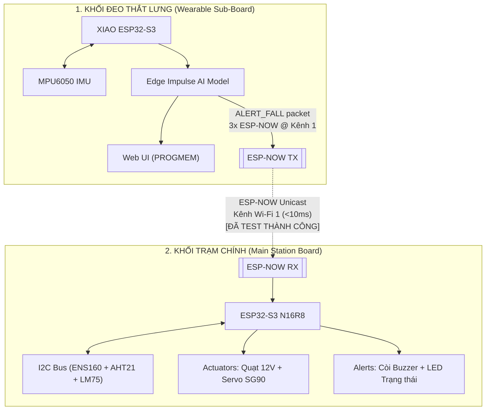
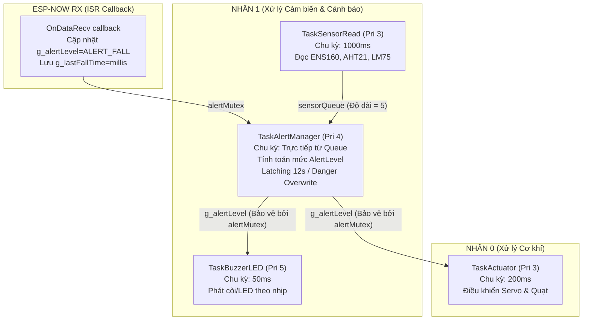

# HỆ THỐNG GIÁM SÁT MÔI TRƯỜNG & PHÁT HIỆN TÉ NGÃ THÔNG MINH (EDGE AI)
## BÁO CÁO TIẾN ĐỘ DỰ ÁN (WORK IN PROGRESS) - TÀI LIỆU PHỤC VỤ THIẾT KẾ SLIDE TRÊN NOTEBOOKLM

> ⚠️ **LƯU Ý QUAN TRỌNG:** Đây là **BÁO CÁO TIẾN ĐỘ DỰ ÁN** (chưa phải phiên bản thương mại hoàn chỉnh). Hệ thống đang được tích hợp cuốn chiếu theo từng giai đoạn thử nghiệm.

---

## 📌 CHƯƠNG I: TỔNG QUAN DỰ ÁN (OVERVIEW)

### 1. Đặt vấn đề & Mục tiêu dự án
*   **Vấn đề thực tế:** Sự kết hợp nguy hiểm giữa các yếu tố môi trường độc hại (khí độc eCO2, TVOC, nhiệt độ tăng cao do hỏa hoạn) và các tai nạn cá nhân (té ngã ở người cao tuổi hoặc công nhân trong phân xưởng sản xuất).
*   **Mục tiêu dự án:** Xây dựng một hệ sinh thái giám sát kép thông minh:
    1.  **Hệ thống cố định (Main Board):** Giám sát thời gian thực các chỉ số chất lượng không khí, nhiệt độ, độ ẩm và tự động phản ứng cơ khí (quạt gió, servo cửa thông phòng).
    2.  **Hệ thống đeo thắt lưng (Wearable Board):** Nhận diện hành vi con người (Đứng yên, Đi bộ, Té ngã) bằng mô hình Học máy nhúng (Edge AI) chạy trực tiếp trên thiết bị (On-device Inference).

### 2. Kiến trúc hai khối độc lập (Dual-Board Architecture)
Hệ thống được thiết kế dạng mô-đun hóa với sự phân chia nhiệm vụ tối ưu:

---

## 🛠️ CHƯƠNG II: THÔNG SỐ KỸ THUẬT & SƠ ĐỒ PHẦN CỨNG

### 1. Board điều khiển chính (Main Station)
*   **MCU:** ESP32-S3 N16R8 (16MB Flash, 8MB PSRAM cấu hình OPI).
*   **Bộ nhớ:** Hỗ trợ dung lượng lưu trữ lớn phục vụ lưu trữ web UI và đệm dữ liệu.
*   **Hệ điều hành:** FreeRTOS đa nhiệm thời gian thực (Real-time Multitask).
*   **Firmware chính:** `src/Rtos_main/Rtos_main.ino`

### 2. Bảng phân phối chân linh kiện (Pin Mapping)

#### Khối Trạm Chính (Main ESP32-S3)
| Linh kiện | Chân GPIO | Vai trò / Phương thức giao tiếp |
| :--- | :--- | :--- |
| **Buzzer** | GPIO2 | Còi phát tín hiệu âm thanh cảnh báo |
| **Status LED** | GPIO4 | Đèn chỉ thị nhịp trạng thái |
| **Servo SG90** | GPIO5 | Động cơ mở van thông khí (PWM 50Hz, 500-2500µs)|
| **Fan 12V** | GPIO6 | Quạt hút khí độc (Được đệm qua Transistor NPN 2N2222) |
| **I2C SDA** | GPIO8 | Chân truyền dữ liệu cảm biến I2C |
| **I2C SCL** | GPIO9 | Chân nhịp xung clock cảm biến I2C (400 kHz) |

#### Khối Đeo Thắt Lưng (XIAO ESP32-S3 Sub-board)
| Linh kiện | Chân GPIO | Vai trò / Phương thức giao tiếp |
| :--- | :--- | :--- |
| **MPU6050 SDA** | GPIO5 | Truyền nhận dữ liệu gia tốc và vận tốc góc |
| **MPU6050 SCL** | GPIO6 | Phát xung clock I2C cho IMU |
| **Truyền thông** | Không dây | **ESP-NOW Kênh 1** — truyền `FallAlertPacket` siêu tốc về Trạm Chính |

---

## 🧠 CHƯƠNG III: KHỐI CHÍNH - FREERTOS ĐA NHIỆM THỜI GIAN THỰC
*(Mã nguồn phát triển: `src/Rtos_main/Rtos_main.ino`)*

Để đảm bảo tính năng an toàn tính mạng không bao giờ bị trễ do nghẽn CPU, khối trạm chính chạy 4 Task FreeRTOS độc lập phân bổ trên 2 nhân xử lý. **Ngoài ra, Trạm chính hiện đã tích hợp nhận tín hiệu ESP-NOW từ Thiết bị đeo.**

### 1. Đồng bộ hóa phần cứng & Phần mềm (Sync Primitives)
*   **`sensorQueue`:** Chuyển dữ liệu cấu trúc `SensorData` từ Task đọc sang Task xử lý. Cơ chế tự động giải phóng phần tử cũ nhất nếu đệm đầy để tránh thất thoát dữ liệu mới.
*   **`alertMutex`:** Khóa bảo vệ biến trạng thái toàn cục `g_alertLevel` khi được ghi từ Task Quản lý (hoặc ESP-NOW callback) và đọc từ các Task đầu ra (Còi, Động cơ).

### 2. Thuật toán Hợp nhất Cảm biến (Sensor Fusion Logic)
*   **Cross-Check chéo nhiệt độ:** Đọc đồng thời cảm biến nhiệt độ tích hợp `AHT21` và cảm biến nhiệt độ dự phòng công nghiệp `LM75` (địa chỉ `0x48`).
*   **Thuật toán tự sửa lỗi (Self-Healing):**
    *   Nếu cả 2 cảm biến hoạt động tốt: Nhiệt độ trung bình = (T_AHT21 + T_LM75) / 2.
    *   Nếu phát hiện sự chênh lệch bất thường > 15°C: Hệ thống đánh dấu trạng thái nghi ngờ, tự động ưu tiên lấy giá trị của cảm biến chính xác cao `LM75`.
    *   Nếu một trong hai cảm biến mất kết nối vật lý, hệ thống vẫn duy trì hoạt động bằng cảm biến còn lại và chuyển cảnh báo hệ thống sang mức `WARNING`.

### 3. Phân cấp Cảnh báo & Mô hình Phản ứng (Alert Levels)

| Mức Cảnh Báo | Điều Kiện Kích Hoạt | Chỉ Thị Buzzer / LED | Trạng Thái Actuator |
| :--- | :--- | :--- | :--- |
| **ALERT_NONE (0)** | Mọi chỉ số môi trường ở ngưỡng an toàn | LED: OFF / Buzzer: OFF | Servo: 0° / Quạt: OFF |
| **ALERT_WARNING (2)** | Mất kết nối ≥ 1 cảm biến **Hoặc:** eCO2 ≥ 800ppm, TVOC ≥ 150ppb | LED: ON / Buzzer: 200ms ON / 800ms OFF | Servo: 90° / Quạt: ON |
| **ALERT_DANGER (3)** | eCO2 ≥ 1500ppm, TVOC ≥ 500ppb, AQI ≥ 4, Nhiệt độ ≥ 60°C | LED: ON / Buzzer: 100ms ON / 200ms OFF | Servo: 180° / Quạt: ON |
| **ALERT_CRITICAL (4)** | Ngưỡng nguy hiểm tột cùng từ cảm biến | LED: ON / Buzzer: LIÊN TỤC | Servo: 180° / Quạt: ON |
| **ALERT_FALL (5)** ⭐ | Nhận gói tin `FallAlertPacket` từ Thiết bị đeo qua ESP-NOW | LED: Nháy siêu nhanh 5Hz / Buzzer: LIÊN TỤC | Servo: **0°** (giữ nguyên) / Quạt: **OFF** |

> **Cơ chế ưu tiên an toàn (Danger Overwrite):** Nếu `ALERT_DANGER`/`ALERT_CRITICAL` xảy ra đồng thời với `ALERT_FALL`, hệ thống ngay lập tức đè để bật quạt và mở servo 180° bảo vệ tính mạng.  
> **Cơ chế Latching 12s:** Trạng thái `ALERT_FALL` được duy trì 12 giây sau gói tin cuối cùng nhận được trước khi tự động giải phóng.

---

## 🏃 CHƯƠNG IV: THIẾT BỊ ĐEO THẮT LƯNG - AI NHẬN DIỆN TÉ NGÃ EDGE AI
*(Mã nguồn phát triển: `src/wearable/wearable_unified_rtos/wearable_unified_rtos.ino`)*

Thiết bị sử dụng cảm biến quán tính 6 trục MPU6050 kết hợp với nhân vi điều khiển XIAO ESP32-S3 nhỏ gọn, **hiện chạy đa nhiệm FreeRTOS với 3 task độc lập.**

### 1. FreeRTOS Task Map (Wearable)
| Task | Core | Priority | Stack | Chức năng |
| :--- | :--- | :--- | :--- | :--- |
| `TaskIMURead` | Core 1 | 5 | 4096 B | Đọc MPU6050 @ 100Hz, đẩy vào `imuQueue` |
| `TaskEdgeAI` | Core 1 | 4 | 4096 B | Lấy từ `imuQueue`, suy luận AI, Debounce/Cooldown, **phát ESP-NOW** khi phát hiện ngã |
| `TaskNetworkWeb` | Core 0 | 3 | 6144 B | Web server, state machine INGESTION, HTTPS upload Edge Impulse |

### 2. Giao tiếp ESP-NOW từ Thiết bị đeo
*   Wi-Fi chế độ `WIFI_AP_STA` — SoftAP `Wearable_AP` khóa cứng ở Kênh 1
*   Gói tin nén `FallAlertPacket` (packed struct, 10 byte): `alertType=0xFA`, `fallCount`, `confidence`, `timestamp`
*   Phát **3 lần liên tiếp** (giãn cách 5ms) khi xác nhận ngã để chống mất gói do nhiễu

### 3. Động cơ hai chế độ tích hợp (Dual-Mode Engine)
*   **Chế độ 1: THU MẪU (Data Ingestion Mode)**
    *   Thu thập dữ liệu cảm biến thô (6 trục IMU) ở tần số chuẩn 100Hz.
    *   Tự động chia nhỏ, gán nhãn hoạt động (`idle`, `walk`, `fall`) thông qua giao diện điều khiển trực tuyến.
    *   Kết nối HTTPS gửi thẳng tệp JSON nén lên server **Edge Impulse Studio**.
*   **Chế độ 2: SUY LUẬN (Real-time Inference Mode)**
    *   Nhúng trực tiếp mô hình phân loại được huấn luyện từ Edge Impulse.
    *   Chạy suy luận liên tục dạng cửa sổ trượt (Continuous Sliding Window) với chu kỳ đáp ứng ~370ms.

### 4. Công nghệ Tăng cường Dữ liệu tại chỗ (On-Device Data Augmentation)
1.  **Thuật toán Nhân Tỷ Lệ (Scaling - 3x Augmentation):** Mỗi chuỗi chuyển động thô tự động nhân bản ra 3 biến thể (x1.00, x0.94, x1.06).
2.  **Thuật toán Gây Nhiễu Quán Tính (Jittering Mode):** Thêm nhiễu ngẫu nhiên Gauss cực nhỏ (±0.02g gia tốc / ±1°/s con quay).

### 5. Công nghệ Lọc & Khống chế Báo động Giả (Anti-False Alarm Layer)
*   **Confirm Slices Filter:** `FALL_ALERT_THRESHOLD = 0.85`, `FALL_CONFIRM_SLICES = 3` — xác suất ngã phải vượt ngưỡng liên tục 3 lần.
*   **Cooldown Lockout:** `FALL_COOLDOWN_MS = 6000` (6 giây) — khóa tín hiệu phát báo động sau cú ngã đầu tiên.

---

## 🌐 CHƯƠNG V: GIAO DIỆN QUẢN TRỊ CHUYÊN NGHIỆP
*(Tệp tin lưu trữ: `src/wearable/wearable_unified_rtos/html_page.h`)*

Trang web điều khiển được lập trình bằng ngôn ngữ HTML/CSS/JS thuần, tối ưu hóa dung lượng để nén cứng vào bộ nhớ Flash (`PROGMEM`) của vi điều khiển, truy cập trực tiếp qua địa chỉ IP của thiết bị.

### Các tính năng cao cấp trên giao diện Web UI:
1.  **Đồng bộ hóa giao diện mặc định (Auto-inference Sync):** Mỗi khi tải hoặc tải lại trang (reload), giao diện web tự động kích hoạt chế độ **Suy luận (Inference)**.
   
---

## 🚦 CHƯƠNG VI: TRẠNG THÁI HIỆN TẠI & KẾ HOẠCH TIẾP THEO

### Đã hoàn thành
| # | Hạng mục | Trạng thái |
| :--- | :--- | :--- |
| 1 | Firmware baseline `main.ino` (ENS160, AHT21, LM75, Buzzer, LED) | ✅ Hoàn thành |
| 2 | `Rtos_main.ino` — FreeRTOS 4 tasks (SensorRead/AlertManager/BuzzerLED/Actuator) | ✅ Hoàn thành |
| 3 | Thiết bị đeo `wearable_unified.ino` — Edge AI + Web UI | ✅ Hoàn thành |
| 4 | Tích hợp FreeRTOS vào Thiết bị đeo (`wearable_unified_rtos.ino`) — 3 tasks | ✅ Hoàn thành |
| 5 | Bộ lọc chống báo giả (Debounce + Cooldown) | ✅ Hoàn thành |
| 6 | **Tích hợp code ESP-NOW vào cả 2 board** | ✅ Hoàn thành |
| 7 | Cơ chế Latching 12s + Danger Overwrite trên Trạm chính | ✅ Hoàn thành |
| 8 | **Kiểm thử tích hợp ESP-NOW thực tế trên 2 thiết bị** | ✅ Đã test thành công |
| 9 | **Kiểm thử các thiết bị Quạt / Servo / Đèn LED / Buzzer** | ✅ Đã test thành công |

### Cần làm tiếp theo
| # | Hạng mục | Ưu tiên |
| :--- | :--- | :--- |
| 🔴 | **Xây dựng Web UI cho Trạm chính (N16R8)** hiển thị thông số nhiệt độ, độ ẩm và khí độc | **KHẨN CẤP** |
| 🔴 | **Hợp nhất Web UI của 2 thiết bị** thành một giao diện quản lý tập trung duy nhất | **KHẨN CẤP** |

---

## 📈 CHƯƠNG VII: KỊCH BẢN THUYẾT TRÌNH SLIDE GỢI Ý (PITCH DECK)

*   **Slide 1:** Tiêu đề & Giới thiệu — Tên dự án, giải pháp kết hợp giám sát môi trường & Edge AI đeo thắt lưng.
*   **Slide 2:** Đặt vấn đề & Nhu cầu thực tế — Tai nạn công nghiệp và gia đình.
*   **Slide 3:** Thiết kế Hệ thống kép (Dual-Board System) — Main Board (ESP32-S3) + Wearable Sub-board (XIAO).
*   **Slide 4:** Phần cứng & Pin Map — Bảng thông số kỹ thuật.
*   **Slide 5:** Sức mạnh FreeRTOS đa nhiệm — 4 Task song song 2 nhân CPU trên Main Board + 3 Task trên Wearable.
*   **Slide 6:** Công nghệ Hợp nhất cảm biến thông minh — Cross-check AHT21 và LM75.
*   **Slide 7:** Học Máy trên Thiết Bị Đeo — Edge Impulse, cửa sổ trượt 370ms.
*   **Slide 8:** Giải pháp Tăng cường dữ liệu — Scaling 3x + Jittering.
*   **Slide 9:** Lớp Lá Chắn Chống Báo Giả — Confirm Slices + Cooldown.
*   **Slide 10:** Giao tiếp không dây ESP-NOW — Kênh 1, gói tin packed, 3x redundancy, Latching 12s.
*   **Slide 11:** Giao diện vận hành Web UI nén PROGMEM.
*   **Slide 12:** Kết quả & Lộ trình — Code hoàn chỉnh, cần test thực tế 2 thiết bị.
